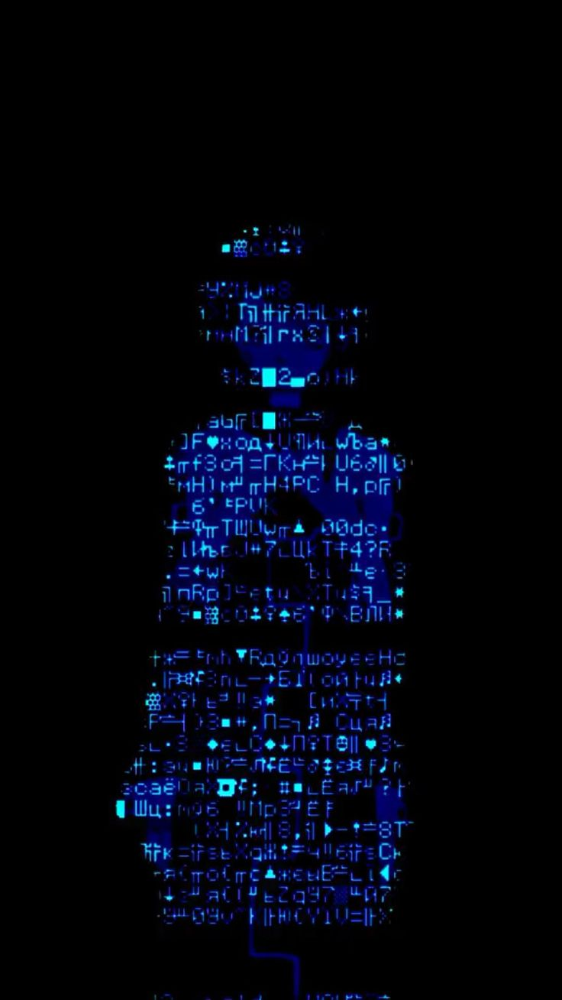

<div align="center">


#### It's not hype!

### About me:


  `MarkDown Senior`

<div align="left">

```shell
#!/bin/bash
echo -e "\033[38;2;75;207;251m█████████████████████"
echo -e "\033[38;2;245;171;185m█████████████████████"
echo -e "\033[38;2;255;255;255m█████████████████████"
echo -e "\033[38;2;245;171;185m█████████████████████"
echo -e "\033[38;2;75;207;251m█████████████████████"
```
</div>


My twitter: [*click*](https://x.com/nouwushka)

### My stack:


<p>


</p>
